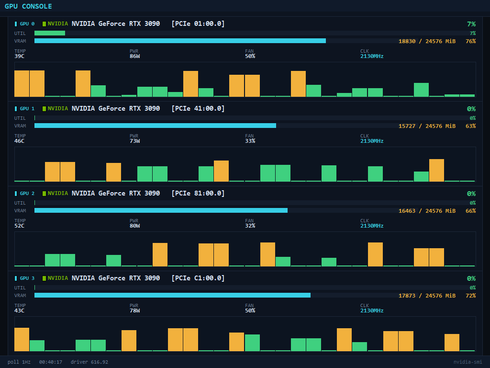

# GPU Console

桌面 GPU 监控 HUD —— 多显卡实时利用率 / 显存 / 温度 / 功耗 / 风扇 / 频率,
带 30 秒利用率历史图,无边框窗口可拖拽,F11 等比全屏。



## 特性

- **多 GPU 逐卡显示**:每张卡独立卡片(品牌色标 + 型号 + PCIe 槽位)
  - 品牌识别:NVIDIA(绿)/ AMD(红)/ Intel(蓝),未知显卡显示原始名称
- **每卡指标**:UTIL 利用率条、VRAM 显存条(数值与条同行,不遮挡)、
  TEMP 温度、PWR 功耗、FAN 风扇、CLK 核心频率
- **30 秒利用率历史图**:每卡取自身数据,颜色随负载变化
- **无边框窗口**:自绘标题条拖拽移动;位置记忆(`position.json`)
- **F11 等比全屏**:所有坐标与字体按同一比例放大,letterbox 居中,不变形
- **Esc / Q / 右键** 退出
- **数据源**:`nvidia-smi`(优先目标机系统 PATH 版本,随包捆绑一份兜底)
- 1 Hz 轮询,`nvidia-smi` 无黑窗闪烁(`CREATE_NO_WINDOW`)

## 下载与安装

**获取**:[Release v1.0.0 页面](https://github.com/JumpEggKiller/gpu-console/releases/latest) 点 **Download** 下载 `GPU Console Setup.exe`
(固定链接:https://github.com/JumpEggKiller/gpu-console/releases/latest)。

**安装**(运行该 exe,需管理员权限):
- 装到 `C:\Program Files\GPU Console`,可选开始菜单/桌面图标
- 装完自动启动;右键 / Esc / Q 退出

**要求**:Windows 10/11 x64 + NVIDIA 显卡驱动
(随包已捆绑 `nvidia-smi.exe` 作兜底,数据以驱动为准)。

## 构建

```bat
:: 1) PyInstaller 单文件 exe
python -m PyInstaller "GPU Console.spec" --noconfirm
:: 2) Inno Setup 安装包(需 Inno Setup 6)
"C:\Program Files (x86)\Inno Setup 6\ISCC.exe" gpu_console.iss
```

产物:`installer\GPU Console Setup.exe`

> 中文界面语言文件 `langs_ChineseSimplified.isl` 已随仓库提供
> (Inno Setup 6.5 官方未带简体中文),`gpu_console.iss` 直接引用它。

## CI

`.github/workflows/build.yml`:每次 push 在 `windows-latest` 上重建安装包,
产物可下载(Actions → Artifacts → `GPU-Console-Windows-x64`)。

## 文件说明

| 文件 | 用途 |
|---|---|
| `gpu_console.py` | 主程序(纯 tkinter 自绘,无第三方运行时依赖) |
| `GPU Console.spec` | PyInstaller 打包配置(捆绑 `tools/nvidia-smi.exe`) |
| `gpu_console.iss` | Inno Setup 安装脚本 |
| `tools/nvidia-smi.exe` | 随包捆绑的 nvidia-smi(兜底数据源) |
| `gpu_console.ico` | 应用图标 |
| `build_win.py` | 本机一键构建脚本(PyInstaller + ISCC) |

## License

MIT — see [LICENSE](LICENSE)
